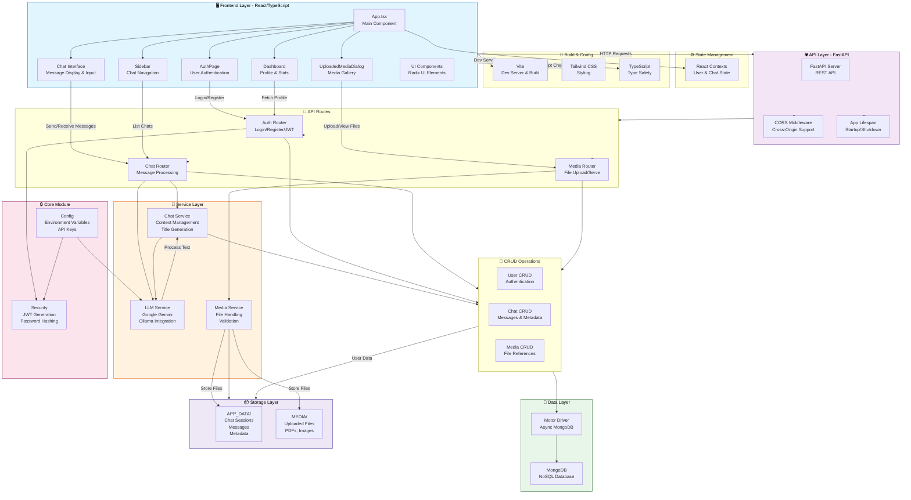

# Digi-Doc System Architecture

## System Architecture Diagram

## Component Descriptions

### Frontend Layer
- **App.tsx**: Main application component, routing hub
- **AuthPage**: User login and registration interface
- **Chat Interface**: Real-time message display and input with token streaming
- **Dashboard**: User profile overview and health summaries
- **Sidebar**: Navigation between chat sessions
- **UploadedMediaDialog**: Gallery view of uploaded medical documents
- **UI Components**: Reusable Radix UI-based components

### Backend API
- **FastAPI Server**: RESTful API serving all client requests
- **CORS Middleware**: Handles cross-origin requests
- **Lifespan Management**: Initializes and cleans up resources (Gemini client, MongoDB)

### API Routes
- **Auth Router**: User authentication, JWT token generation, registration
- **Chat Router**: Message creation, retrieval, context management, AI title generation
- **Media Router**: File uploads, validation, secure file serving

### Service Layer
- **LLM Service**: Integration with Google Gemini 2.5 Flash and Ollama (Gemma)
- **Chat Service**: Context preservation (last 10 messages), response streaming
- **Media Service**: File handling, validation (PDF, PNG, JPG), organization

### Core Modules
- **Config**: Environment variable management, API key storage
- **Security**: JWT token generation/validation, password hashing

### Data Layer
- **MongoDB**: NoSQL database for scalable data storage
- **Motor**: Async MongoDB driver for non-blocking operations
- **CRUD Operations**: Abstracted database operations for users, chats, and media

### Storage Layer
- **APP_DATA/**: Chat sessions with messages and metadata (JSON files)
- **MEDIA/**: Uploaded medical documents organized by chat session

## Data Flow

1. **User Authentication**: Frontend sends credentials → Auth Router → Security module → User CRUD → MongoDB
2. **Chat Message**: Frontend sends message → Chat Router → LLM Service → Gemini API → Streaming response
3. **Media Upload**: Frontend uploads file → Media Router → Media Service → FILE_STORAGE
4. **Chat Context**: Chat Router retrieves last 10 messages from MongoDB → Included in LLM request

## Key Features
- **Real-time Streaming**: Token-by-token response delivery via SSE
- **Secure Authentication**: JWT-based session management
- **Asynchronous Operations**: Motor driver enables non-blocking database calls
- **Modular Architecture**: Separation of concerns across routers, services, and CRUD
- **Media Management**: Centralized gallery with authenticated access
