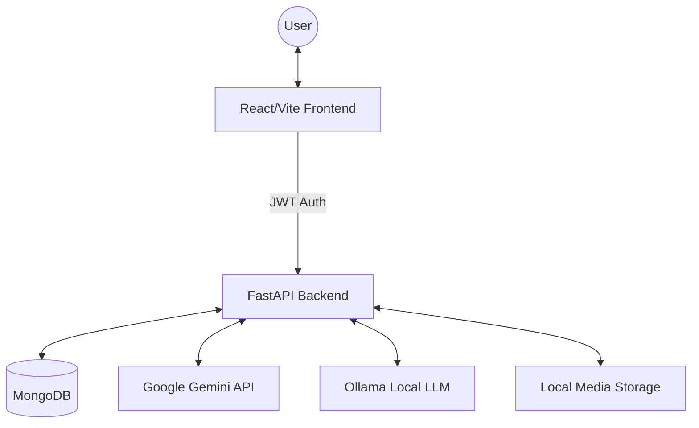

# Digi-Doc - Implementation Summary

## 📋 Quick Links
| Section | Purpose |
|---------|---------|
| [Overview](#overview) | Project summary and capabilities |
| [Features](#implemented-features) | Implemented functionality status |
| [Architecture](#system-architecture) | System design and data flow |
| [API](#backend-api) | Backend endpoint specifications |
| [Components](#frontend-components) | Frontend component structure |
| [Storage](#data-storage) | Data organization and schemas |
| [Workflows](#user-flow) | User interaction flows |
| [Development](#development-guide) | Setup and contributing guidelines |

---

## Overview

**Digi-Doc** is a sophisticated medical AI assistant that has evolved from a local-file-based system to a scalable, database-driven application. It features:
- ✅ **JWT-based Authentication**: Secure user registration and login.
- ✅ **MongoDB Integration**: Robust persistence for users, chats, and messages.
- ✅ **Cloud LLM Integration**: Leveraging **Google Gemini 2.5 Flash** for intelligent medical analysis.
- ✅ **Local LLM Support**: Optional integration with **Ollama (Gemma 3:1B)**.
- ✅ **Advanced Media Processing**: OCR for medical images and text extraction from PDFs.
- ✅ **Real-time Streaming**: Token-by-token response streaming for a responsive feel.

---

## Implemented Features

### 🎯 Core Features

#### 1. Authentication & User Management
| Feature | Status | Details |
|---------|--------|---------|
| User Registration | ✅ | Collects medical profile (About Me, DOB, etc.) |
| Secure Login | ✅ | JWT-based session management |
| Profile Summary | ✅ | AI-generated bullet points of user background |
| Protected Routes | ✅ | Frontend & Backend enforcement of auth |

#### 2. Chat & LLM Interaction
| Feature | Status | Details |
|---------|--------|---------|
| Streaming Responses | ✅ | SSE-based token-by-token delivery |
| Chat History Context | ✅ | Sends last 10 messages for conversational memory |
| Smart Title Generation| ✅ | AI generates 3-5 word titles from first response |
| Session Persistence | ✅ | Saved to MongoDB with owner associations |

#### 3. Media Processing (OCR/PDF)
| Feature | Status | Details |
|---------|--------|---------|
| Image Analysis | ✅ | Gemini-powered OCR and medical image summary |
| PDF Extraction | ✅ | Detailed medical report analysis |
| Media Gallery | ✅ | View all uploaded files across all user chats |
| File Serve API | ✅ | Authenticated media retrieval via token |

---

## System Architecture

### Data Flow Diagram


### Backend Structure
The backend is transitioninig to a modular layout in `backend/app/`:
- `core/`: Configuration, security, and LLM initializations.
- `db/`: MongoDB client and database connection logic.
- `routers/`: Authentication, Chat, and Media endpoints.
- `schemas/`: Pydantic models for request/response validation.
- `services/`: Business logic for LLM processing and media analysis.

---

## Backend API

### Authentication
- `POST /register`: Registers a new user and returns a JWT.
- `POST /login`: Authenticates user and returns a JWT.
- `GET /me`: Returns current user profile data.

### Chat Operations
- `POST /ask_a`: Main streaming chat endpoint with history support.
- `GET /chats`: Lists all chats belonging to the authenticated user.
- `GET /chat-data/{chat_id}`: Retrieves full message history and media for a chat.
- `POST /save-message`: Persists message metadata (user/bot/media references).
- `POST /update-chat-title`: Manually or automatically update chat titles.
- `POST /generate-title`: AI utility to suggest titles based on bot responses.

### Media Operations
- `POST /process-image`: Uploads and analyzes images or PDFs using Gemini.
- `GET /user/media`: Fetches all media uploaded by the user across all sessions.
- `GET /media/{chat_id}/{filename}`: Serves the physical media file (authenticated).

---

## Frontend Components

### **AuthContext.tsx**
Manages the global authentication state, storing the JWT in local storage and providing `login`/`logout` functions.

### **AuthPage.tsx**
Handles both Login and Registration UI, switching between modes dynamically.

### **Dashboard.tsx**
Provides a central hub for user statistics and overview (future expansion).

### **App.tsx**
The main orchestrator. It manages:
- Real-time SSE streaming for chat.
- Navigation between chat and dashboard views.
- Synchronization of chat history and active sessions.

---

## Data Storage

### MongoDB Schema
- **Users**: `_id`, `name`, `email`, `password_hash`, `about`, `about_summary`, `date_of_birth`.
- **Chats**: `_id`, `user_id`, `title`, `created_at`, `updated_at`.
- **Messages**: `_id`, `chat_id`, `sender`, `text`, `media`, `timestamp`.

### Media Assets
Stored locally in the `backend/MEDIA/{chat_id}/` directory. Files are referenced in the `Messages` collection in MongoDB.

---

## Development Guide

### Prerequisites
- **Python 3.10+**
- **Node.js 18+**
- **MongoDB** (Local or Cloud instance)
- **Ollama** (Optional, for local Gemma models)

### Environment Variables (`backend/.env`)
```env
GEMINI_API_KEY=your_key
MONGODB_URL=mongodb://localhost:27017
SECRET_KEY=your_jwt_secret
```

