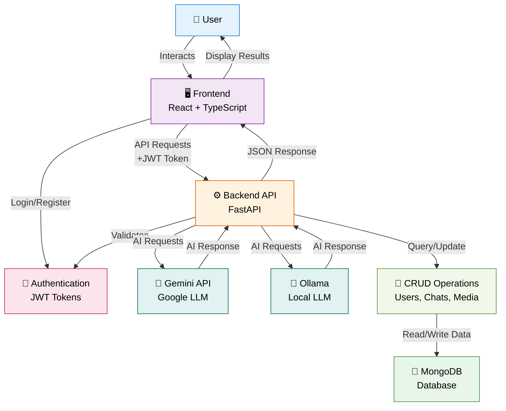

# Digi-Doc - Simple Architecture Overview

## Abstract System Architecture



## Component Overview

| Component | Description | Technology |
|-----------|-------------|-----------|
| **User** | End user interacting with the system | Human |
| **Frontend** | User interface for chat, uploads, and dashboard | React 19, TypeScript, Vite, Tailwind CSS |
| **Authentication** | JWT-based token validation and session management | JWT (JSON Web Tokens) |
| **Backend API** | Core business logic, request handling, data orchestration | FastAPI, Python |
| **Gemini API** | Primary AI model for medical insights and document analysis | Google Gemini 2.5 Flash |
| **Ollama** | Lightweight local AI model (fallback/alternative) | Ollama - Gemma 3:1B |
| **MongoDB** | Persistent data storage for users, chats, and metadata | MongoDB with Motor async driver |
| **CRUD Operations** | Data manipulation for users, chat messages, and media | Database abstraction layer |

## Key Data Flows

### 1. **User Authentication Flow**
```
User → Frontend (Login) → Auth (JWT Generation) → Backend (Validate) → Database (Store User)
```

### 2. **Chat Message Flow**
```
User → Frontend (Send Message) → Backend API (Process) → Gemini/Ollama (AI Response) 
→ Database (Store) → Frontend (Display) → User
```

### 3. **Document Upload Flow**
```
User → Frontend (Upload File) → Backend API (Validate) → Database (Store Reference) 
→ Gemini (Analyze) → Frontend (Display Results) → User
```

### 4. **Dashboard View Flow**
```
User → Frontend (Request Profile) → Backend API (Retrieve) → Database (CRUD Read) 
→ Frontend (Display Summary) → User
```

## Technology Stack Summary

- **Frontend Layer**: React 19, TypeScript, Vite, Tailwind CSS, Radix UI
- **Backend Layer**: FastAPI, Python 3.10+
- **AI/LLM Integration**: Google Gemini 2.5 Flash, Ollama (Gemma)
- **Database**: MongoDB with Motor async driver
- **Authentication**: JWT tokens
- **Real-time**: Server-Sent Events (SSE) for token streaming
